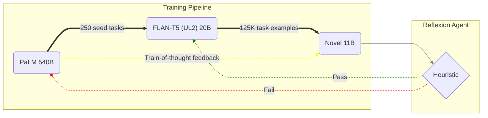

# Overview

This is an overview of the YOINK model architecture and data training pipeline.
An outline of the research and testing process is given below, alongside the
rationale for various decisions made alongside designing YOINK.

## Model Overview

> **TODO**: Explain general rationale for model architecture design and training.

### Transfer Learning

To fully take advantage of the pre-training used on large LLMs (trained on enormous corpora of text), **transfer-learning** can be used to extend the model's training to a new task. By using a large pretrained language model like OpenAI's [GPT-4 model](https://openai.com/research/gpt-4), the larger model can feed high-quality instruction data to smaller LLMs to fine-tune the paraemters of the model to aspecific task. This works as a form of **knowledge distillation**, transferring a concise knowledge representation from the larger model to the smaller model without loss of validity. In this context, the core idea is to use the larger model's strong linguistic generality for generating and tuning exemplar pairs of prompts and outputs to train a smaller model.

#### Parameter-Efficient Training Strategies

##### 1. Low Rank Adapters

Other parameter-efficient tuning techniques exist, such as **adapter modules**[^adapter-modules], which add only a small number of task-specific parameters to the network without requiring retraining the entire model. This also aids in modularity, as parameter-level optimizations are more self-contained to adapter modules themselves, avoiding training all of the model's parameters without any loss of generality. However, this approach also adds additional latency during inference as adapter layers need to be evaluated sequentially.

An extension of this technique called **Low-Rank Adaptation (LoRA)**[^lora] solves this issue by instead freezing the pre-trained model weights and injecting pairs of trainable layers (rank-decomposition matrices) into each transformer block (most notably in the attention layers). This allows for much faster fine-tuning with drastically lower memory footprint as gradient updates don't need to be accumulated for most of the model's weights.

<!-- Citations -->

[^adapter-modules]: N. Houlsby et al., “Parameter-Efficient Transfer Learning for NLP,” Jun. 2019 ([Paper](https://arxiv.org/abs/1902.00751))

[^lora]: E. J. Hu et al., “LoRA: Low-Rank Adaptation of Large Language Models,” Oct. 2021 ([Paper](https://arxiv.org/abs/2106.09685) | [Github](https://github.com/microsoft/LoRA))

##### 2. Quantization Aware Training

> **TODO**

#### Network Optimisations

> **TODO**: Describe parallelism improvements based on insights from the Pathways architecture used for the PaLM model at Google.

> **TODO**: Describe Microsoft's DeepSpeed[^deepspeed] ZeRO research.
>
> DeepSpeed - ZeRO data paralellism:
> - Optimizer State Partitioning
> - Gradient Partitioning
> - Parameter Partitioning
>
> Key insight: Methodology for ... sharding a slice of the full model parameters, gradients and optimizer states.

> **TODO**: Implement DeepSpeed ZeRO (PyTorch) library in Tensorflow/JAX?
>
> Main components: ZeRO-Offload (Adam-1 optimizer), ZeRO-Infinity (NVMe offload)
> - Various ZeRO data parallelism optimizations can be expressed in JAX using APIs like pjit or xmap.

<!-- Citations --->

[^deepspeed]: “ZeRO & DeepSpeed: New system optimizations enable training models with over 100 billion parameters,” Microsoft Research, Feb. 10, 2020 ([Microsoft Research](https://www.microsoft.com/en-us/research/blog/zero-deepspeed-new-system-optimizations-enable-training-models-with-over-100-billion-parameters) | [GitHub](https://github.com/microsoft/DeepSpeed))

##### 1. Data Parallelism and Weight Sharding

> **TODO**

##### 2. Pipeline and Tensor Parallelism

> **TODO**

##### 3. Gradient Checkpointing and Kernel Fusion

> **TODO**

#### Prompting Refinements

##### 1. Chain-of-Thought prompting

On larger language models, reasoning tasks can be improved through the use of **Chain-of-Thought (CoT)**[^chain-of-thought] prompting. By decomposing prompts into smaller more foundational steps, the model can better learn to incorporate underlying patterns in both procedures and in data to formulate responses. This can elicit more complex and robust multi-step reasoning and yield a much larger scaling curve than possible through standard prompting.

Notably, techniques like **Mixture-of-Denoisers (MoD)**[^mixture-of-denoisers] with **self-consistency**[^self-consistency] further refine this process by utilizing an ensemble of denoising objectives to better adapt the model to a variety of different language domains. The culmination of these techniques is especially useful in transfer learning as it helps align models with downstream tasks or domains.

<!-- Citations -->

[^chain-of-thought]: J. Wei et al., “Chain of Thought Prompting Elicits Reasoning in Large Language Models,” Oct. 2022 ([Google AI Blog](https://ai.googleblog.com/2022/05/language-models-perform-reasoning-via.html) | [Paper](https://arxiv.org/abs/2201.11903))

[^mixture-of-denoisers]: Y. Tay et al., “UL2: Unifying Language Learning Paradigms,” Feb. 2023 ([Google AI Blog](https://ai.googleblog.com/2022/10/ul2-20b-open-source-unified-language.html) | [Paper](https://arxiv.org/abs/2205.05131) | [Github](https://github.com/google-research/google-research/tree/master/ul2))

[^self-consistency]: X. Wang et al., “Self-Consistency Improves Chain of Thought Reasoning in Language Models,” Oct. 2022 ([Paper](https://arxiv.org/abs/2203.11171))

##### 2. Self-Reflection Augmentation

Additionally, the **Reflexion**[^reflexion] technique can be used to explain mistakes made in sub-tasks by imitating self-reflection behavior. This is controlled through evaluating a simple heuristic for detecting common failure modes like hallucination, which then prompts re-evaluation for further trial and error. Combining this technique with chain-of-thought prompting enables a much more effective transfer of knowledge by utilizing the <a name="reference7"><strong>emergent self-reflective behavior</strong></a>[\[7\]](#footnote7) of larger language models in the training of much smaller models.

<!-- Citations -->

[^reflexion]: N. Shinn, B. Labash, and A. Gopinath, “Reflexion: an autonomous agent with dynamic memory and self-reflection,” Mar. 2023 ([Paper](https://arxiv.org/abs/2303.11366))

[^emergence]: J. Wei et al., “Emergent Abilities of Large Language Models,” Oct. 2022 ([Paper](https://arxiv.org/abs/2206.07682))

##### 3. Batch Prompting

A key cost-saving technique is **batch-prompting**[^batch-prompting] which enables language models to pool  multiple numbered prompts and generate a set of responses in a single inference run. This technique is primarily aimed at reducing API costs through tokenization and training time reduction while still achieving better or similar performance. This yields an important cost-saving measure to allow more sophisticated prompting strategies to remain economically viable through tokenization-based pricing for large-language model APIs.

[^batch-prompting]: Z. Cheng, J. Kasai, and T. Yu, “Batch Prompting: Efficient Inference with Large Language Model APIs,” Jan. 2023 ([Paper](https://arxiv.org/abs/2301.08721))

### Cost Analysis

OpenAI price breakdown for GPT-4 and GPT-3 model APIs:

<table>
    <thead>
        <tr>
            <th>Series</th>
            <th>Model</th>
            <th>Completion</th>
            <th>Prompt</th>
            <th>Context</th>
            <th>TPM</th>
            <th>RPM</th>
            <th>1M Tokens</th>
        </tr>
    </thead>
    <tbody>
        <!-- GPT-4 -->
        <tr>
            <td rowspan=2>GPT-4</td>
            <td>gpt-4-32k-0314</td>
            <td>$0.06/1K</td>
            <td>$0.12/1K</td>
            <td>32K</td>
            <td>80K</td>
            <td>400</td>
            <td>$1,200.00</td>
        </tr>
        <tr>
            <td>gpt-4-0314</td>
            <td>$0.06/1K</td>
            <td>$0.03/1K</td>
            <td>8K</td>
            <td>40K</td>
            <td>200</td>
            <td>$1,200.00</td>
        </tr>
        <!-- GPT-3 -->
        <tr>
            <td>GPT-3</td>
            <td>gpt-3.5-turbo</td>
            <td>$0.002/1K</td>
            <td>$0.002/1K</td>
            <td>4K</td>
            <td>40K</td>
            <td>200</td>
            <td>$4.00</td>
        </tr>
    </tbody>
</table>

Explanation of pricing terminology

* **Completion**:
* **Prompt**:
* **Context**:
* **TPM**: Tokens per minute.
* **RPM**: Reads per minute.
* **1M Tokens**:

* Refer to <a href="https://openai.com/pricing">pricing</a> and <a href="https://platform.openai.com/docs/guides/rate-limits/gpt-4-rate-limits">gpt-4-rate-limits</a> for more information about OpenAI pricing and API limits.

Google Cloud price breakdown of LaMDA 2 and PaLM model APIs:
> **TODO**: Update cost analysis with API costs from Google's PaLM model after public release.
